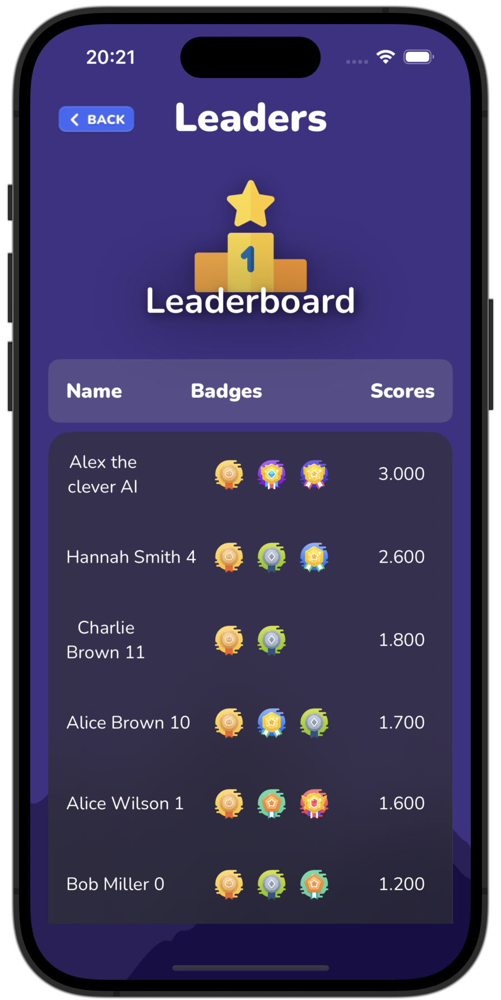

# Getting Started

Welcome to the official repository of the Chess King, a compelling and interactive chess application designed for iOS devices. This game merges traditional chess with modern technology, offering users a dynamic gaming experience complete with various difficulty levels, detailed game analytics, and customizability.

## Project Structure
```
.
├── Teris_MafiaApp.swift              -- Application
├── Views                             -- Main views
│   ├── ContentView.swift             -- Root view
│   ├── MenuView.swift
│   ├── GameView.swift
│   ├── HowToPlayView.swift
│   ├── SettingsView.swift
│   ├── ProfileView.swift
│   └── ...
├── Components                        -- Reusable components
│   ├── CirleButton.swift
│   ├── GradientBackground.swift
│   └── ...
├── Models
│   ├── App                           -- Model related to App's operation
│   │   ├── User.swift
│   │   ├── AppConfig.swift
│   │   └── ...
│   └── ChessBoard                    -- Model related to Game's operation
│       ├── Game.swift
│       ├── Board.swift
│       ├── Piece.swift
│       ├── Rook.swift
│       ├── Michael.swift             -- AI easy level
│       ├── Alex.swift                -- AI medium level
│       ├── TomHuynh.swift            -- AI hard level
│       └── ...
├── Data
│   ├── FileStoreManager.swift        -- Storage implementation with FileManager
│   ├── ModelData.swift               -- Application data model
│   └── SessionManager.swift          -- Manage user session login/register
├── Localizations
│   └── Localization.swift            -- English/Vietnamese translation
├── APIs
├── Utils
│   ├── AudioManager.swift            -- Background music and sound effects
│   └── ...
├── Fonts
├── Musics
├── Animations
├── Modifiers
└── Extensions
```

## Features

### Game Modes and Views
- **Login and Register View**: The entry point of the game start, user can either login to an account or create new (not require any password).
- **Menu View**: The primary navigation hub that directs players to all other views.
- **Game View**: The heart of the application where users engage in chess matches.
- **Leaderboard View**: Showcases player rankings, high scores, and badges earned through gameplay milestones. User can also get some statistics or view other player profile in the leaderboard.
- **How To Play View**: A detailed guide with 14 comprehensive steps with visuals explaining the rules and strategies of chess.
- **Game Settings View**: Allows users to customize game settings including difficulty, themes, sound and languages.
- **Profile View**: Personal space for user to see their stats, progression over time and their also can change their avatar in profile view.

### Detailed Features
- **Multiple Difficulty Levels and Play Modes**: From beginner to expert, challenging the AI or competing in two-player mode.
- **Achievement Badges**: Similar to other ranking game, badges highlight player achievements and encourage game exploration. The game has a total of 8 badges with different level of difficulty to archieve.
- **Interactive Graphs**: Visualize player statistics with bar charts and line charts, displaying player's score over time to track player's progression that encourage player to play and improve their ranking everyday.
- **Customizable Themes**: Players can customize the look and feel of the game with various themes: two themes for Application and three themes for chess board.
- **Multilingual Support**: Supports multiple languages, enhancing accessibility for a global audience including English and Vietnamese.

## Setup Instructions

### Prerequisites
- Xcode 15.3 or later
- iOS 17.0 or later

### Installation

1. **Clone the repository:**
```sh
git clone https://github.com/yourusername/iOS-Chess-Game.git
```

2. **Open the project in Xcode:**
Navigate to the cloned directory and open the `.xcodeproj` file.

3. **Install dependencies:**
The project uses external libraries, please install their dependencies first before build the project: [PopupView](https://github.com/exyte/PopupView) and [SwiftUICharts](https://github.com/willdale/SwiftUICharts)

4. **Build and Run:**
Build the project with `Cmd + B` and run it on your preferred device or simulator with `Cmd + R`.

## App Usage Examples

- **Register and Login:**
In first 'PlayerPicker' view choose your own account or register a new account. The account name will be unique and sanitized before creating. An error will yield if you do not input a valid username.

- **Starting a Game:**
In main menu choose 'Play vs AI' or 'Two Players' from the Menu View and start playing. If you do not know how to play just go to 'How to Play' section first. Note that the medium and hard AI only run if device connected to the internet, otherwise a random move will be picked.

- **Stats and Progression after Game:**
After game ended, there will be sound effect for appropriate state (win or lose), and stats of the game (number of moves, en passant, castling,..) and the most important players's scores adjustment to enforce competition in game.

- **Viewing Leaderboards:**
Navigate to the Leaderboard from the Menu to see top scores and player achievements, also the bar chart showing rare badge counts right below of the leaderboard.

- **Adjusting Settings:**
In the Settings View, tweak game difficulty, change themes, turn sound effect on/off or switch the game language.

- **Learning to Play:**
Visit the How To Play View for interactive tutorials and gameplay strategie. This section include 14 steps with tips and tricks, you can play very gud after completing the tutorial.

## Technical Features

- **Device Compatibility**: Optimized for iPhone 15, 15 Pro, 15 Pro Max, and iPad Pro (11 inch).
- **Light/Dark Mode Compatibility**: Ensures that the UI looks great in both light and dark modes as per device settings.
- **Save and Resume Functionality**: Players can save their game progress and resume later, ensuring flexibility in gameplay even if the game is exited completely from the background the app can retain the game state (although this feature sometimes still has bugs but good to use).
- **Game Progression and Levels**: The game includes various levels of difficulties, badges for AI beater and high scores; Score adjustments between game; hence adding depth and replay value.

## AI Game Agent
The game offer 3 level of AI difficulty easy, medium and hard. The hard one will have an elo around 2500, which is really hard to beat, I'm really encourage reader to beat it. Both medium and hard AI is just rest API calling from [Stockfish](https://stockfish.online/) with different search depths. In addition, the easy one is handcrafted and also not really easy, his brain is Minimax with alpha-beta pruning that always pick the most valuable move at any time, so try your self with easy one first.

## Sound and UI

- **Background Music**: Background music ingrated in all the views. More specific, some view will have their own music songs such as  Menu, How To Play, and Leaderboard views to enhance user experience.
- **Sound Effects**: Included for user interactions and game events to make the gameplay more immersive.

## Documentation

Find additional documentation on architecture, API usage, and game mechanics in the `document.pdf` within this repository.

## Contributing

Feel free to contribute to improving the game!

## Previews





